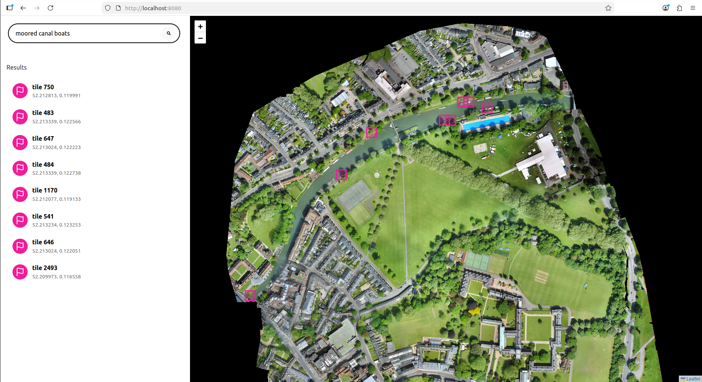
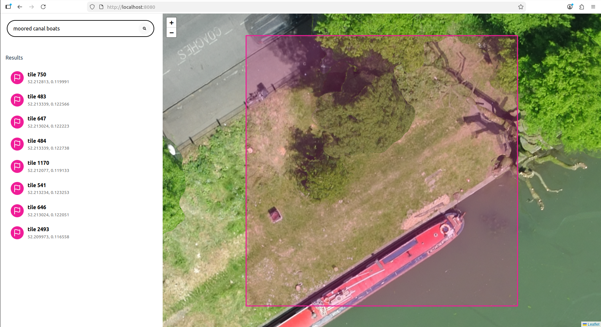
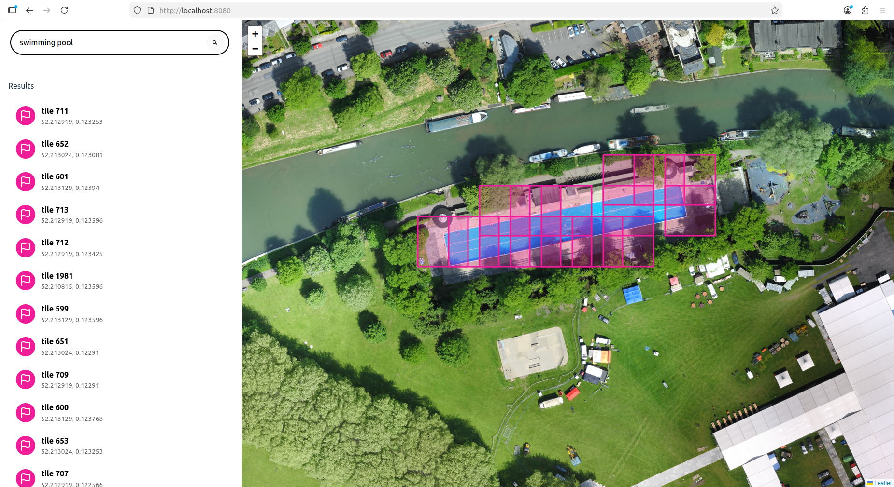
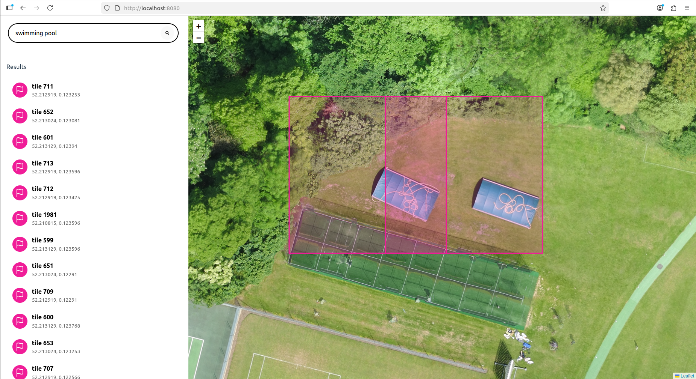
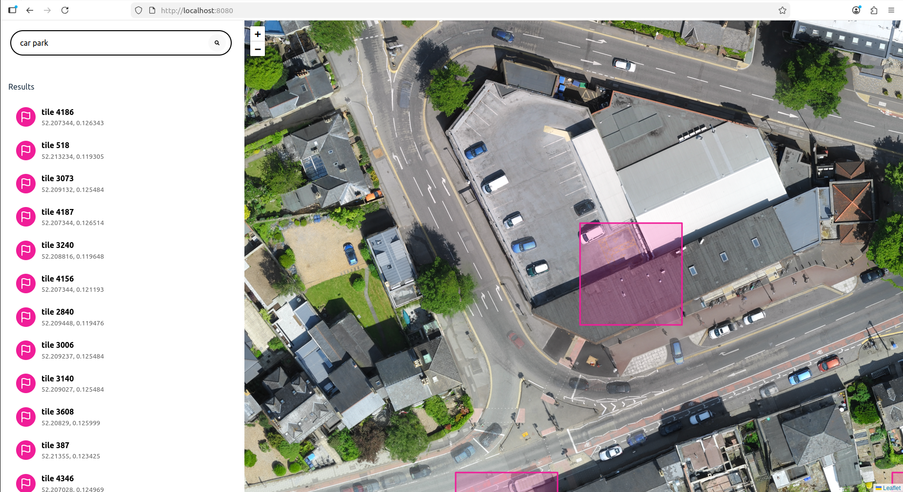

# CLIP Map App

This app allows users to search for features in aerial imagery using natural language. It uses a CLIP model to pre-compute embeddings for a set of image tiles, which are then indexed with Faiss. Faiss enables efficient nearest-neighbor searches, allowing the app to quickly compare a user’s text query embedding with the pre-computed image embeddings and identify the most relevant images.

When a user performs a search, relevant tiles are retrieved from the index. The map boundaries are then adjusted to display only the area containing these results. The user can click on a tile—either on the map or in the sidebar—to zoom directly to that specific tile.

<p float="left">
  
  
</p>

## Overview of Design
1. **Python Server.** Best for use with PyTorch, the OpenAI CLIP library and geospatial libraries like RasterIO.
2. **React Typescript frontend.** React is a popular frontend framework, used with styled components for quick modular styling. For this project, I was keen to experiment with TypeScript for the first time.

## Improvements To Be Made
1. **Speed up tile loading.** The tile loading is currently quite slow because the orthophoto is being opened for each new request.
2. **Group together overlapping tiles.** Where tiles overlap, it's probably more intuitive to treat these tiles as one area that resolves to one result in side bar and one polygon on the map.
    <p float="left">
        
    </p>
3. **Improve the accuracy of the model.** At the moment, the model sometimes returns false positives for certain queries and fails to detect some features in others. Alternative models may offer improved performance, and prompt engineering could further refine the results. Creating a test set of phrase–image pairs would help evaluate model performance and determine the optimal combination of model, prompt, and similarity threshold.
    <p float="left">
        
        
    </p>

## Run in Docker
The entire app can be run using a couple of Docker commands. The docker container is built on [Nvidia Pytorch Docker Containers](https://catalog.ngc.nvidia.com/orgs/nvidia/containers/pytorch), which helps avoid most dependency conflicts that can arise from different CUDA and PyTorch versions. The main drawback is that these containers are quite large, so pulling the base image during the first build can take several minutes. Additionally, to use GPUs inside the Docker container, you must have the [Nvidia Container Toolkit](https://docs.nvidia.com/datacenter/cloud-native/container-toolkit/latest/install-guide.html) installed on your machine.

To build the docker container:
```
cd map_app
docker build -t map .
```

Before running the container, set these paths to the repository and data directories to match their locations on your machine. The data directory should contain a directory called `tiles` and an orthophoto called `source_full.tif`.
```
export SRC_PATH=/home/user/workspace/map_app
export DATA_PATH=/home/user/workspace/labs-take-home-data
```

Finally, run the docker container. If you don   't have a GPU, remove `--gpus all`; everything will run on the CPU just fine. It may take a couple of minutes to install dependencies, load the model, and create embeddings. Once the message “application ready” appears, the app should be available at `http://localhost:8080`.

```
docker run -it --rm --gpus all --shm-size=4g -p 8080:8080 \
    --ulimit memlock=-1 \
    --ulimit stack=67108864 \
    -v $SRC_PATH:/workspace/map_app \
    -v $DATA_PATH:/workspace/map_app/backend/data \
    map:latest \
    bash -c "source /usr/local/nvm/nvm.sh \
            && nvm use default \
            && npm install --prefix frontend \
            && npm run build --prefix frontend \
            && python backend/create_embeddings.py \
            && uvicorn backend.main:app --host 0.0.0.0 --port 8080 --log-level warning"

```
